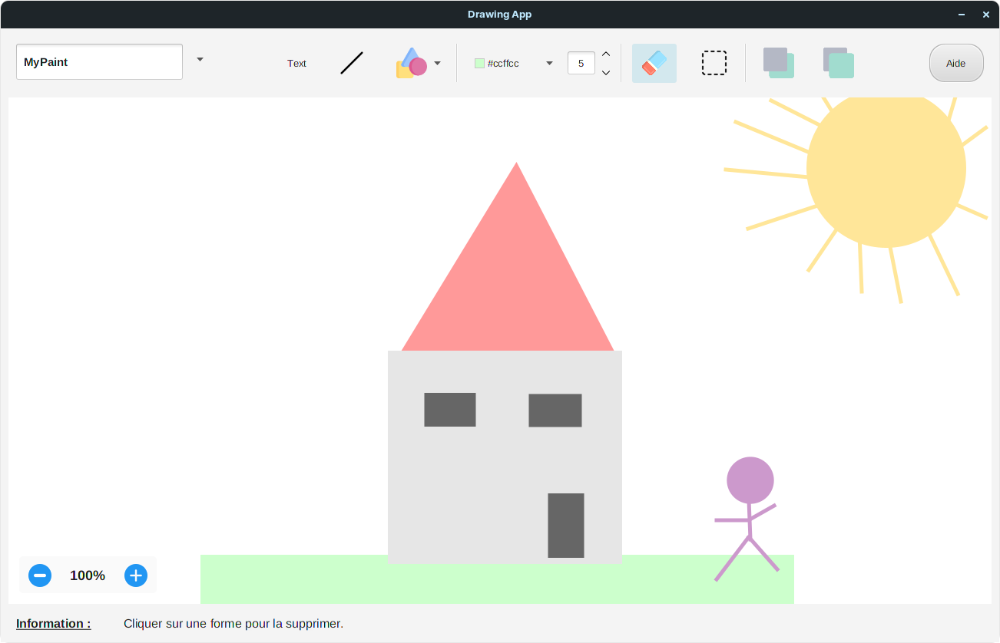

# Drawing Application
This drawing application is designed to create vector shapes. It allows users to draw solid geometric shapes, move them around, choose their color, resize them, and organize them in the foreground or background.

## Features
* **Draw** solid geometric shapes to illustrate your ideas.
* **Move** shapes around to position them where you want.
* Customize the **color** of shapes to make them stand out.
* **Resize** shapes to fit your needs.
* Organize shapes in **foreground** or **background** to structure your drawing.
* **Save** your drawings to share them with your collaborators.
* **Zoom** in on your drawing to see details.
* Add **text** to annotate your drawing and clarify your ideas.

## Prerequisites
- Java
- JavaFx

## Credits
This project was done as part of a university project with [@betacodd](https://github.com/betacodd).
